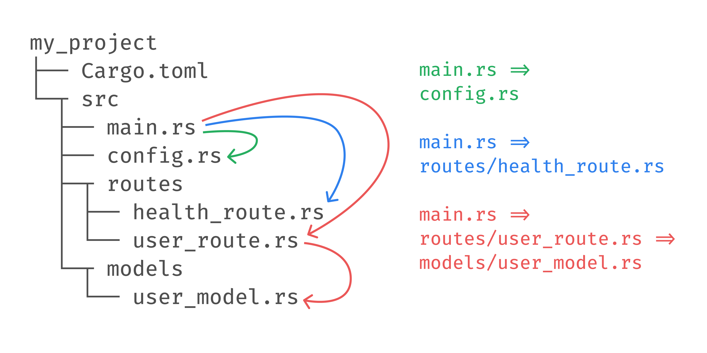
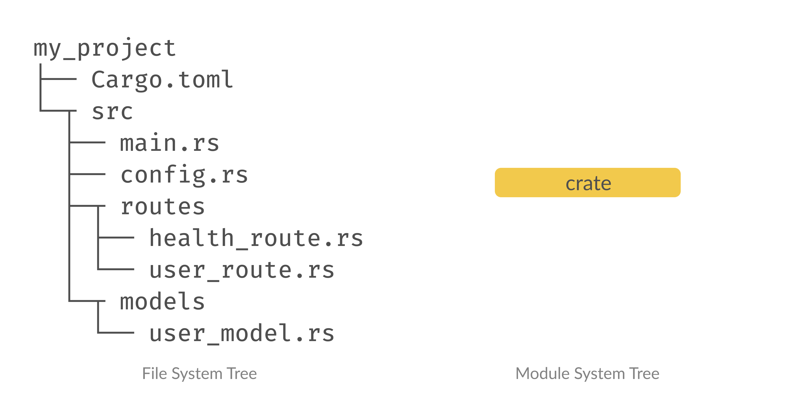
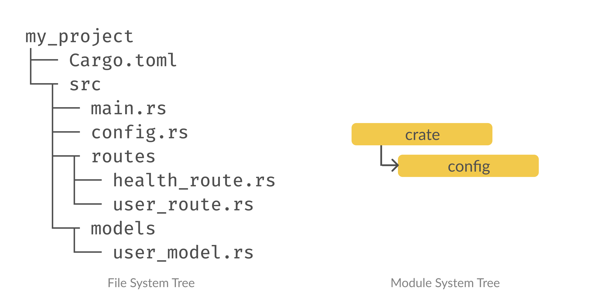
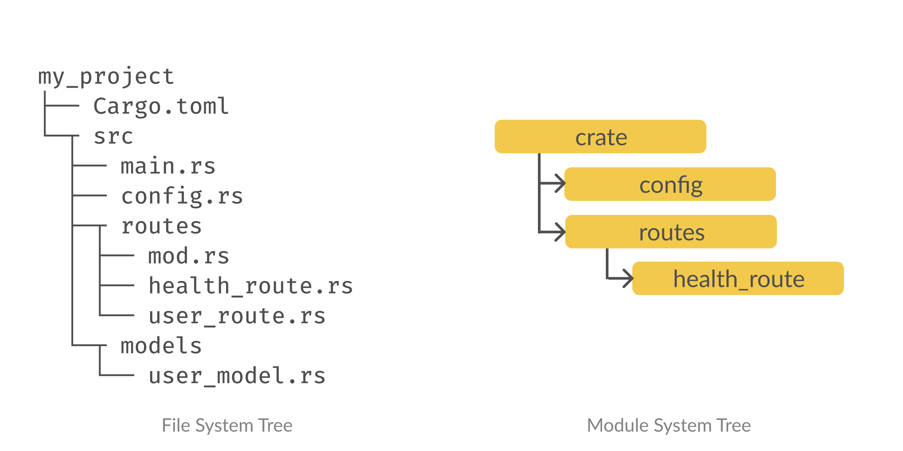
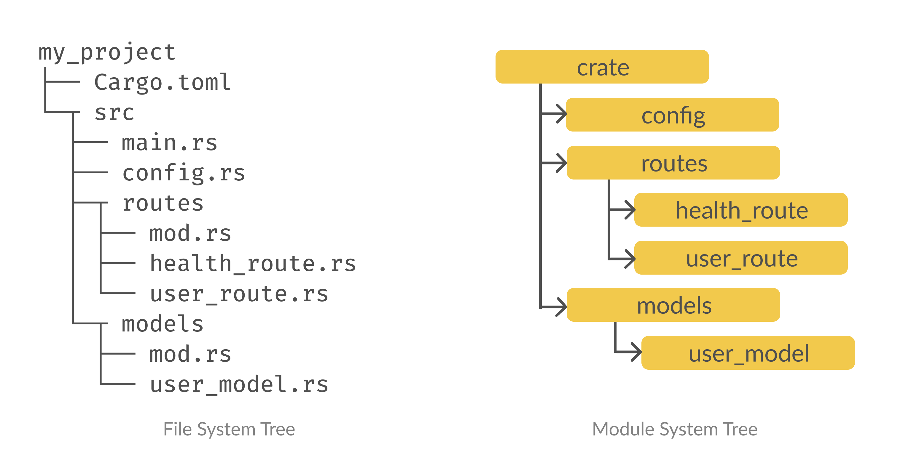

https://www.sheshbabu.com/posts/rust-module-system/

Rust的模块系统出乎意料地令人困惑，给初学者带来了很多挫折感。

在这篇文章中，我将用实际的例子来解释模块系统，这样你就能清楚地了解它是如何工作的，并能立即开始在你的项目中应用它。

由于Rust的模块系统相当独特，我要求读者以开放的心态阅读这篇文章，并抵制将其与其他语言的模块工作方式进行比较。

让我们用这个文件结构来模拟一个真实世界的项目。

```bash
my_project
├── Cargo.toml
└─┬ src
  ├── main.rs
  ├── config.rs
  ├─┬ routes
  │ ├── health_route.rs
  │ └── user_route.rs
  └─┬ models
    └── user_model.rs
```

这些是我们应该能够消费我们的模块的不同方式:



这3个例子应该足以解释Rust的模块系统如何工作。

## 例子1

让我们从第一个例子开始--在 `main.rs` 中导入 `config.rs`。

```rust
// main.rs
fn main() {
  println!("main");
}
```

```rust
// config.rs
fn print_config() {
  println!("config");
}
```

每个人都会犯的第一个错误是，仅仅因为我们有 `config.rs`、`health_route.rs` 等文件，我们就认为这些文件是模块，我们可以从其他文件导入它们。

下面是我们看到的（文件系统树）和编译器看到的（模块树）。



令人惊讶的是，编译器只看到 crate 模块，也就是我们的 `main.rs` 文件。这是因为我们需要在Rust中明确建立模块树--文件系统树和模块树之间没有隐式映射。

> 我们需要在Rust中显式建立模块树，没有隐式映射到文件系统中。

要将一个文件添加到模块树中，我们需要使用 mod 关键字将该文件声明为一个子模块。接下来让人困惑的是，你会认为我们在同一个文件中声明一个文件为模块。但我们需要在不同的文件中声明！因为我们只有 `main.rs` 。由于我们在模块树中只有 `main.rs`，让我们把 `config.rs` 声明为 `main.rs` 中的一个子模块。

> mod 关键字声明一个子模块

mod关键字的语法是这样的:

```rust
mod my_module;
```

这里，编译器会在同一目录下寻找 `my_module.rs` 或 `my_module/mod.rs` 。

```bash
my_project
├── Cargo.toml
└─┬ src
  ├── main.rs
  └── my_module.rs

or

my_project
├── Cargo.toml
└─┬ src
  ├── main.rs
  └─┬ my_module
    └── mod.rs
```

由于 `main.rs` 和 `config.rs` 在同一个目录下，让我们把 `config` 模块声明如下。

```rust
// main.rs
mod config;

fn main() {
  config::print_config();
  println!("main");
}
```

```rust
// config.rs
fn print_config() {
  println!("config");
}
```

我们使用 `::` 语法访问 `print_config` 函数。

下面是模块树的样子:



我们已经成功声明了 `config` 模块! 但这还不足以让我们在 `config.rs` 中调用 `print_config` 函数。Rust中几乎所有的东西默认都是私有的，我们需要使用pub关键字将该函数公开。

pub关键字使事物公开:

```rust
// main.rs
mod config;

fn main() {
  config::print_config();
  println!("main");
}
```

```rust
// config.rs
- fn print_config() {
+ pub fn print_config() {
  println!("config");
}
```

现在，这起作用了。我们已经成功地调用了一个定义在不同文件中的函数!

## 例子2

让我们试着从 `main.rs` 中调用 `routes/health_route.rs` 中定义的 `print_health_route` 函数。

```rust
// main.rs
mod config;

fn main() {
  config::print_config();
  println!("main");
}
```

```rust
// routes/health_route.rs
fn print_health_route() {
  println!("health_route");
}
```

正如我们前面讨论的，我们只能对同一目录下的 `my_module.rs` 或 `my_module/mod.rs` 使用 `mod` 关键字。

所以为了从 `main.rs` 调用 `routes/health_route.rs` 里面的函数，我们需要做以下事情:

- 创建一个名为 `routes/mod.rs` 的文件，在 `main.rs` 中声明 `routes` 子模块

- 在 `routes/mod.rs` 中声明 `health_route` 子模块并使其公开

- 将 `health_route.rs` 中的函数公开

```bash
my_project
├── Cargo.toml
└─┬ src
  ├── main.rs
  ├── config.rs
  ├─┬ routes
+ │ ├── mod.rs
  │ ├── health_route.rs
  │ └── user_route.rs
  └─┬ models
    └── user_model.rs
```

```rust
// main.rs
mod config;
+ mod routes;

fn main() {
+ routes::health_route::print_health_route();
  config::print_config();
  println!("main");
}
```

```rust
// routes/mod.rs
+ pub mod health_route;
```

```rust
// routes/health_route.rs
- fn print_health_route() {
+ pub fn print_health_route() {
  println!("health_route");
}
```

下面是模块树的样子:



我们现在可以调用一个文件夹内的文件中定义的函数。

## 例子3

让我们试试从 `main.rs => routes/user_route.rs => models/user_model.rs` 中调用：

```rust
// main.rs
mod config;
mod routes;

fn main() {
  routes::health_route::print_health_route();
  config::print_config();
  println!("main");
}

// routes/user_route.rs
fn print_user_route() {
  println!("user_route");
}

// models/user_model.rs
fn print_user_model() {
  println!("user_model");
}
```

我们想从 main 的 print_user_route 中调用函数 print_user_model。

让我们做和以前一样的修改--声明子模块，使函数公开，并添加 mod.rs 文件。

```bash
my_project
├── Cargo.toml
└─┬ src
  ├── main.rs
  ├── config.rs
  ├─┬ routes
  │ ├── mod.rs
  │ ├── health_route.rs
  │ └── user_route.rs
  └─┬ models
+   ├── mod.rs
    └── user_model.rs
```

```diff
// main.rs
mod config;
mod routes;
+ mod models;

fn main() {
  routes::health_route::print_health_route();
+ routes::user_route::print_user_route();
  config::print_config();
  println!("main");
}

// routes/mod.rs
pub mod health_route;
+ pub mod user_route;
// routes/user_route.rs
- fn print_user_route() {
+ pub fn print_user_route() {
  println!("user_route");
}

// models/mod.rs
+ pub mod user_model;
// models/user_model.rs
- fn print_user_model() {
+ pub fn print_user_model() {
  println!("user_model");
}
```

下面是模块树的样子。



等等，我们实际上还没有从 `print_user_route中` 调用 `print_user_model`! 到目前为止，我们只从 `main.rs` 中调用了其他模块中定义的函数，我们如何从其他文件中调用呢？

如果我们看一下我们的模块树，`print_user_model` 函数位于 `crate::models::user_model` 路径中。所以为了在非main.rs的文件中使用一个模块，我们应该从模块树中到达该模块的必要路径来考虑。

```diff
// routes/user_route.rs
pub fn print_user_route() {
+ crate::models::user_model::print_user_model();
  println!("user_route");
}
```

我们已经成功地从一个不是 main.rs 的文件中调用了一个定义在文件中的函数。

## super

如果我们的文件组织深入到多个目录，全称就会变得过于冗长。假设由于某种原因，我们想从 `print_user_route` 调用 `print_health_route`。这些文件分别在 `crate::routes::health_route` 和 `crate::routes::user_route` 的路径下。

我们可以使用全称 `crate::routes::health_route::print_health_route()` 来调用它，但我们也可以使用相对路径`super::health_route::print_health_route()`;。注意，我们用super来指代父级范围。

> 模块路径中的super关键字指的是父作用域

```rust
pub fn print_user_route() {
  crate::routes::health_route::print_health_route();
  // can also be called using
  super::health_route::print_health_route();

  println!("user_route");
}
```

## use

在上面的例子中，如果使用完全合格的名称，甚至是相对名称，都是很繁琐的。为了缩短名称，我们可以使用 use 关键字，将路径绑定到一个新的名称或别名上。

> use关键字用于缩短模块的路径

```rust
pub fn print_user_route() {
  crate::models::user_model::print_user_model();
  println!("user_route");
}
```

上述代码可以重构为：

```rust
use crate::models::user_model::print_user_model;

pub fn print_user_route() {
  print_user_model();
  println!("user_route");
}
```

我们可以不使用 `print_user_model` 这个名字，而是把它别名为其他东西:

```rust
use crate::models::user_model::print_user_model as log_user_model;

pub fn print_user_route() {
  log_user_model();
  println!("user_route");
}
```

## 外部模块

添加到 `Cargo.toml` 中的依赖关系对项目中的所有模块都是可用的。我们不需要明确地导入或声明任何东西来使用一个依赖关系。

> 外部依赖对项目中的所有模块都是全局可用的。

例如，假设我们将 `rand` crate添加到我们的项目中。我们可以在我们的代码中直接使用它，例如:

```rust
pub fn print_health_route() {
  let random_number: u8 = rand::random();
  println!("{}", random_number);
  println!("health_route");
}
```

我们也可以用使用来缩短路径:

```rust
use rand::random;

pub fn print_health_route() {
  let random_number: u8 = random();
  println!("{}", random_number);
  println!("health_route");
}
```

## 摘要

- 模块系统是明确的--与文件系统没有1:1的映射关系

- 我们在一个文件的父级中声明模块，而不是文件本身

- mod 关键字用于声明子模块

- 我们需要明确地将函数、结构体等声明为 public 的，这样它们就可以被其他模块所使用

- pub关键字使事物公开

- use关键字用于缩短模块的路径

- 我们不需要明确声明第三方模块

