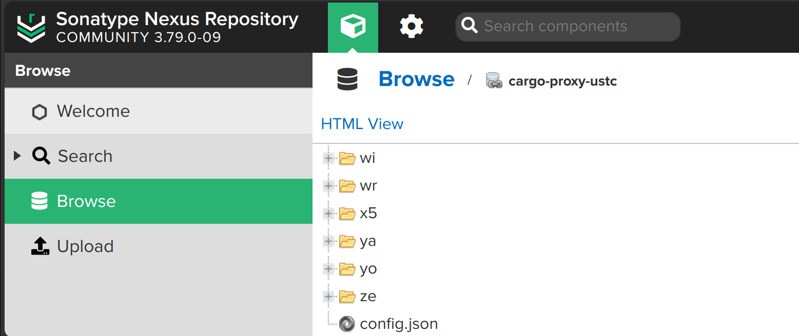

为了加速 cargo 的构建，最好配置 cargo 的源为国内的源，或者使用 nexus 的代理源。

## 使用国内源

```bash
vi ~/.cargo/config
```

打开（或创建）配置文件  `.cargo/config`，加入以下内容：

```properties
[source.crates-io]
# 指定使用下面哪个源，修改为source.后面的内容即可
replace-with = 'ustc'

#阿里云
[source.aliyun]
registry = "sparse+https://mirrors.aliyun.com/crates.io-index/"

# 中国科学技术大学
[source.ustc]
registry = "https://mirrors.ustc.edu.cn/crates.io-index"

# 上海交通大学
[source.sjtu]
registry = "https://mirrors.sjtug.sjtu.edu.cn/git/crates.io-index/"

# 清华大学
[source.tuna]
registry = "https://mirrors.tuna.tsinghua.edu.cn/git/crates.io-index.git"

# rustcc社区
[source.rustcc]
registry = "https://code.aliyun.com/rustcc/crates.io-index.git"
```

参考：

- [rust - How do I debug `cargo build` hanging at "Updating crates.io index"? - Stack Overflow](https://stackoverflow.com/questions/53361052/how-do-i-debug-cargo-build-hanging-at-updating-crates-io-index)

- [cargo 使用国内源加速构建](https://www.cnblogs.com/trigger-cn/p/18334279)

## 使用 nexus 代理源

nexus 支持 cargo 的代理， 具体可以参考：

- [Nexus 3 Rust Cargo Support](https://help.sonatype.com/en/rust-cargo.html)

但这个文档实在太过简陋， 很多地方没有说清楚， 所以这里详细说明下。

### 配置 nexus 代理源

在 nexus 下创建一个 cargo proxy 代理仓库，用于官方仓库：

- cargo-proxy-cratesio： https://index.crates.io

> 注意： 只能代理官方仓库 `cargo-proxy-cratesio`， 不能代理国内的源，下面有说明。

再创建一个 cargo hosted 仓库

- cargo-hosted

最后再创建一个 cargo group 仓库， 名为 `cargo-all`， 将上面两个仓库添加进去，顺序为：

- cargo-hosted
- cargo-proxy-ustc

### 配置 cargo 使用 nexus 代理源

```bash
vi ~/.cargo/config
```

打开（或创建）配置文件  `.cargo/config.toml`，加入以下内容：

```properties
[registries.nexus]
index = "sparse+http://192.168.0.246:8081/repository/cargo-proxy-cratesio/"

[registry]
default = "nexus"

[source.crates-io]
replace-with = "nexus"

[source.nexus]
registry = "sparse+http://192.168.0.246:8081/repository/cargo-proxy-cratesio/"
```

参考：

- [Nexus proxy repository for Cargo/Rust](https://gist.github.com/mashintsev/3e6ab7840d6233ab7932565d056b8158)

### 现有问题

但这里有个问题，就是 cargo proxy 仓库只能代理官方仓库 https://index.crates.io， 而不能代理国内的源， 

会报错：

```bash
warning: spurious network error (2 tries remaining): failed to get successful HTTP response from `http://192.168.0.246:8081/repository/cargo-proxy-ustc/crates/async-recursion/1.1.1/download` (192.168.0.246), got 500
body:
```

暂时没有找到解决办法， 所以只能使用官方仓库作为 cargo proxy 仓库的上游源头。


## 验证构建

### 构建 linkerd2-proxy

尝试构建 linkerd2-proxy， 验证是否能正常构建：

```bash
git clone https://github.com/linkerd/linkerd2-proxy.git
cd linkerd2-proxy

# 确保安装了以下依赖
sudo apt install -y cmake make gcc g++
sudo apt install -y clang libclang-dev

# 设置环境变量
export RUSTFLAGS="--cfg tokio_unstable"

# 构建
cargo build
```

代理成功之后， 下载 cargo crates 的速度会非常快， cargo 代理仓库的内容如下图所示：



### 清理 cache 和 index

为了多次验证， 需要清理 cache 和 index：

```bash
# 第一次运行时需要安装 cargo-cache  
cargo install cargo-cache

# 清理 cache 和 index
cargo cache -a

# 清理 registry 索引
rm -rf ~/.cargo/registry/index/*

# 清理 git 索引
rm -rf ~/.cargo/git/*

# 清理 build 缓存
cargo clean
```

遇到特殊情况，可以考虑重置 cargo 的配置：

```bash
rm -rf ~/.cargo/
# 重新安装 rust
curl --proto '=https' --tlsv1.2 -sSf https://sh.rustup.rs | sh

# 重新初始化 Cargo
rustup update
```


