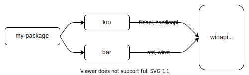

https://doc.rust-lang.org/cargo/reference/features.html


Cargo的 "feature" 提供了一种用来表达条件编译和可选依赖关系的机制。包在 `Cargo.toml` 的 `[features]` 表中定义了一组命名的特性，每个特性都可以被启用或禁用。正在构建的包的特性可以在命令行中用 `--features` 等标志启用。依赖项的特性可以在`Cargo.toml`的依赖项声明中启用。

关于如何使用特性的一些例子，也请参见特性示例一章。

## [features]部分

在 `Cargo.toml` 的 `[features]` 表中定义了特性。每个特性都指定了它所启用的其他特性或可选依赖关系的数组。下面的例子说明了如何将特性用于二维图像处理库，其中对不同图像格式的支持可以选择性地包括在内。

```toml
[features］
# 定义了一个名为 "webp"的特性，该特性不启用任何其他特性。
webp = []
```

定义了这个特性后，cfg表达式可以用来在编译时有条件地包含代码以支持所要求的特性。例如，在包的lib.rs里面可以包括这个:

```toml
// 这有条件地包括一个实现WEBP支持的模块。
#[cfg(feature = "webp")]
pub mod webp;
```

Cargo 使用 rustc `--cfg` 标志在包中设置特性，代码可以用 `cfg` 属性或 `cfg` 宏来测试它们的存在。

特性可以列出要启用的其他特性。例如，ICO图像格式可以包含BMP和PNG图像，所以当它被启用时，应该确保这些其他功能也被启用。

```toml
[features］
BMP = []
png = []
ico = ["bmp", "png"]
webp = []
```

特性名称可以包括 `Unicode XID标准` 中的字符（包括大多数字母），另外还允许以 `_` 或数字0到9开头，在第一个字符之后还可以包含`-`、`+`或`.`

{}
crates.io 对特性名称的语法施加了额外的限制，即它们必须是 ASCII 字母数字字符或`_`、`-`或`+`。
{}


## 默认特性

默认情况下，所有的特性都是禁用的，除非明确启用。这可以通过指定默认功能来改变。

```toml
[features］
default = ["ico", "webp"]
bmp = []
png = []
ico = ["bmp", "png"]
webp = []
```

当软件包被构建时，`default` 特性被启用，这反过来又会启用所列出的特性。这种行为可以通过以下方式改变：

- `--no-default-features` 命令行标志禁用软件包的默认特性。

- 可以在依赖关系声明中指定 `default-features = false` 选项。

{}
在选择默认特性集时要小心。默认特性是一种便利，使用户更容易使用软件包，而不需要强迫用户仔细选择启用哪些常用的特性，但也有一些缺点。除非指定 `default-features = false`，否则依赖关系会自动启用默认功能。这就很难保证默认特性不被启用，特别是对于一个在依赖关系图中出现多次的依赖关系。每个包都必须确保指定 `default-features = false` 来避免启用它们。

另一个问题是，从默认集中删除一个特性可能是SemVer不兼容的改变，所以你应该确信你会保留这些特性。
{}

## 可选依赖关系

依赖关系可以被标记为"optional"，这意味着它们将不会被默认编译。例如，假设我们的2D图像处理库使用一个外部包来处理GIF图像。这可以这样表达:

```toml
[dependencies］

gif = { version = "0.11.1", optional = true }
```

可选依赖关系隐含地定义了一个与依赖关系同名的特性。这意味着可以在代码中使用相同的 `cfg(feature = "gif") `语法，并且可以像启用 `--features gif` 这样的特性一样启用该依赖关系（见下面的命令行特性选项）。

{}
`[feature]`表中的特性不能与依赖关系使用相同的名称。实验性地支持启用此功能和其他扩展功能，可通过命名功能在 nightly 频道中使用。
{}

明确定义的特性也可以启用可选的依赖关系。只要在特性列表中包括可选依赖的名称即可。例如，假设为了支持AVIF图像格式，我们的库需要启用另外两个依赖项：

```toml
[dependencies]
ravif = { version = "0.6.3", optional = true }
rgb = { version = "0.8.25", optional = true }

[features]
avif = ["ravif", "rgb"]
```

在这个例子中，avif特性将启用列出的两个依赖项。

{}
另一种包含依赖关系的方法是使用特定平台的依赖关系。与使用特性不同，这些是基于目标平台的条件。
{}

## 依赖关系的特征

依赖关系的特性可以在依赖关系声明中启用。`features` key 表示要启用哪些特征:

```toml
[dependencies]
# 启用serde的 `derive` 特性。
serde = { version = "1.0.118", features = ["derive"] }
```

可以使用 `default-features = false` 来禁用默认的特性:

```toml
[dependencies]
flate2 = { version = "1.0.3", default-features = false, features = ["zlib"] }
```

{}
这可能无法确保默认功能被禁用。如果另一个依赖关系包括 flate2 而没有指定 `default-features = false` ，那么默认特性将被启用。更多细节请参见下面的特性统一。
{}

依赖关系的特性也可以在 [features] 表中启用。语法是 "package-name/feature-name"。例如。

```toml
[dependencies］
jpeg-decoder = { version = "0.1.20", default-features = false }

[features]
# 通过启用 jpeg-decoder 的 "rayon" 特性来启用并行处理支持。
parallel = ["jpeg-decoder/rayon"]。
```

{}
"package-name/feature-name" 语法也将启用 package-name，如果它是一个可选的依赖关系。禁用该行为的实验性支持在 nightly 频道中通过弱依赖性特性提供。
{}


## 命令行特性选项

以下命令行标志可用于控制哪些特性被启用：

- `--features` FEATURES: 启用列出的特性。多个特性可以用逗号或空格分开。如果使用空格，如果从shell中运行Cargo，请确保在所有特性周围使用引号（如 `--features "foo bar"`）。如果在一个工作区构建多个包，可以使用 `package-name/feature-name` 语法来指定特定工作区成员的特性。

- `--all-features`: 激活在命令行上选择的所有软件包的所有特性。

- `--no-default-features`: 不激活所选软件包的默认特性。

## 特性统一

特性对于定义它们的包来说是唯一的。在一个包上启用一个特性并不会在其他包上启用同名的特性。

当一个依赖关系被多个包使用时，Cargo 会在构建依赖关系时使用该依赖关系上启用的所有特性的联合。这有助于确保只使用该依赖关系的一个副本。更多细节请参见解析器文档的特性部分。

例如，让我们看一下使用大量特性的 `winapi` 包。如果你的包依赖于包 `foo`，它启用了winapi的 "fileapi" 和 "handleapi" 特性，而另一个依赖关系 `bar` 启用了 winapi 的 "std" 和 "winnt" 特性，那么 winapi 将在启用所有这四个特性后被构建:



这样做的结果是，特性应该是累加的。也就是说，启用特性不应该使功能失效，而且通常启用任何特性的组合都是安全的。特性不应该引入 SemVer 不兼容的变化。

例如，如果你想选择性地支持 `no_std` 环境，不要使用 `no_std` 特性。相反，使用启用 `std` 的特性。例如:

```toml
#![no_std]

#[cfg(feature = "std")]
extern crate std;

#[cfg(feature = "std")]
pub fn function_that_requires_std() {
    // ...
}
```

## 相互排斥的特征

在极少数情况下，功能可能会相互不兼容。如果可能的话，应该避免这种情况，因为这需要协调依赖关系图中包的所有用途，以合作避免一起启用它们。如果不可能，可以考虑增加一个编译错误来检测这种情况。例如。

```toml
#[cfg(all(feature = "foo", feature = "bar"))]
compile_error!("feature \"foo\" and feature \"bar\" cannot be enabled at the same time");
```

与其使用相互排斥的特性，不如考虑一些其他的选择：

- 将功能分成独立的包。
- 当有冲突时，选择一个特性而不是另一个。`cfg-if` 包可以帮助编写更复杂的 `cfg` 表达式。
- 构建代码以允许这些特性同时启用，并使用运行时选项来控制使用哪一个。例如，使用配置文件、命令行参数或环境变量来选择启用哪种行为。

## 检查已解决的特性

在复杂的依赖关系图中，有时很难理解不同的特性是如何在不同的软件包上被启用的。`cargo tree` 命令提供了几个选项来帮助检查和显示哪些特性被启用。一些选项可以试试:

- `cargo tree -e features`: 这将显示依赖关系图中的特性。每个特性会显示哪个软件包启用了它。

- `cargo tree -f "{p} {f}"`: 这是一个更紧凑的视图，显示每个软件包上启用的特性的逗号分隔列表。

- `cargo tree -e features -i foo`: 这将反转树形图，显示特性如何流入给定的软件包 "foo"。这可能很有用，因为查看整个图表可能相当大，而且让人不知所措。当你试图弄清楚哪些特性在一个特定的包上被启用以及为什么被启用时，可以使用这个方法。

## 特征解析器版本2

可以用 Cargo.toml 中的 `resolver` 字段指定不同的特性解析器，像这样：

```toml
[package]
name = "my-package"
version = "1.0.0"
resolver = "2"
```

关于指定解析器版本的更多细节，请参见 [解析器版本](https://doc.rust-lang.org/cargo/reference/resolver.html#resolver-versions) 部分。

版本 "2" 的解析器在少数情况下避免了统一特性，因为这种统一可能是不需要的。确切的情况在解析器章节中有描述，但简而言之，它避免在这些情况下进行统一：

- 对于当前没有被构建的目标，在特定平台依赖项上启用的特性被忽略。

- 构建依赖和 proc-macros 不与普通依赖共享特性。

- Dev-dependencies 不激活功能，除非构建一个需要这些功能的目标（如测试或示例）。

在某些情况下，避免统一的做法是必要的。例如，如果 `build-dependency` 启用了 `std` 特性，而同一依赖关系被用作 `no_std` 环境的正常依赖关系，启用 `std` 会破坏构建。

然而，一个缺点是，这可能会增加构建时间，因为依赖关系会被构建多次（每次都有不同的特性）。当使用版本 "2" 解析器时，建议检查那些被多次构建的依赖关系，以减少总体构建时间。如果不需要用单独的特性来构建那些重复的包，可以考虑在依赖关系声明中的特性列表中添加特性，这样重复的包最终就会有相同的特性（因此Cargo只会构建一次）。你可以用 `cargo tree --duplicates` 命令来检测这些重复的依赖关系。它将显示哪些软件包被多次构建；寻找任何列出相同版本的条目。关于获取已解决特征信息的更多信息，请参见检查已解决特征。对于构建依赖，如果你使用 `--target` 标志进行交叉编译，则没有必要这样做，因为在这种情况下，构建依赖总是与普通依赖分开构建。

TBD: 后面的内容似乎意思不大，以后再细看。


